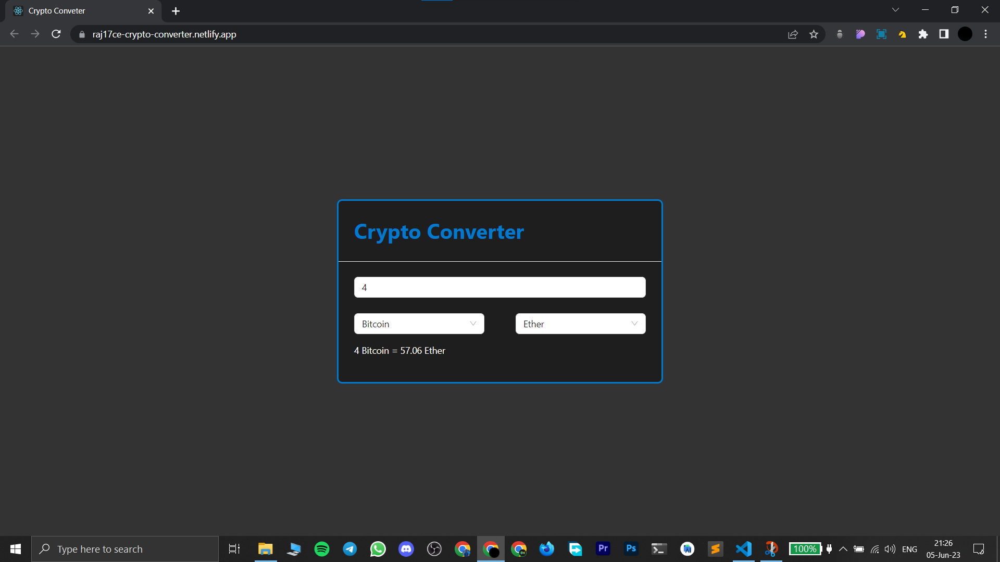

# Crypto-Converter

### [Live Link](https://raj17ce-crypto-converter.netlify.app/)

#### • This WebApp converts the value of a CryptoCurrency in another Crypto or Fiat Currency.

## Functionalities

- You can convert any CryptoCurrency value into the desired Crypto or Fiat Currency.

- You can specify the quantity to convert.

- e.g.

  > 4 Bitcoin = 57.10 Ether

## TechStack

- [ReactJS](https://react.dev/) for creating the single page UI.

- [Create React App](https://create-react-app.dev) for generating folder structure of the project.

- [Ant Design](https://ant.design/) library for React components.

- [CoinGecko](https://apiguide.coingecko.com/) API for fetching real time crypto rates.

- JavaScript for making API calls and logic implementation.

## ScreenShot

 

